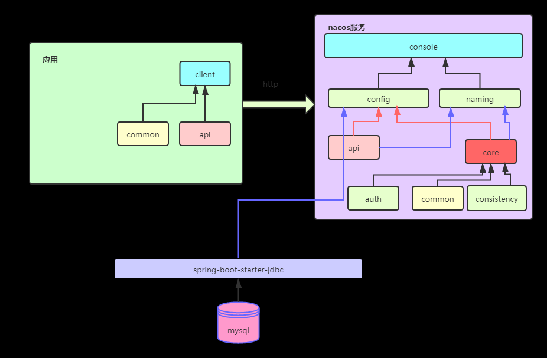
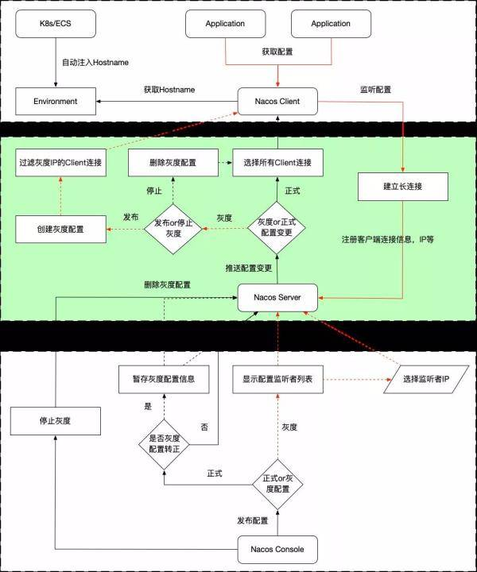
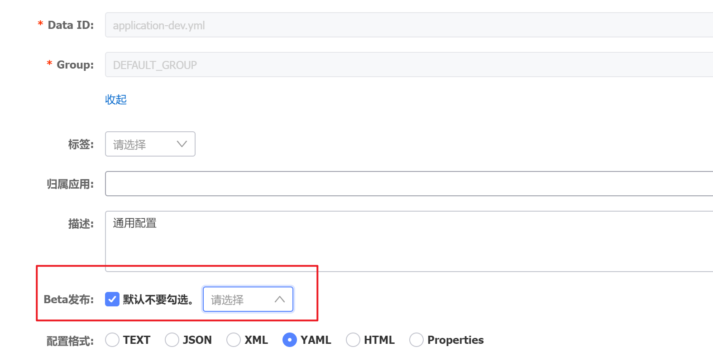

# Nacos: Dynamic  *Na*ming and *Co*nfiguration *S*ervice

[](https://gitter.im/alibaba/nacos?utm_source=badge&utm_medium=badge&utm_campaign=pr-badge)   [](https://www.apache.org/licenses/LICENSE-2.0.html)
[](https://travis-ci.org/alibaba/nacos)

-------

## What does it do

Nacos (official site: [nacos.io](https://nacos.io)) is an easy-to-use platform designed for dynamic service discovery and configuration and service management. It helps you to build cloud native applications and microservices platform easily.

Service is a first-class citizen in Nacos. Nacos supports almost all type of services，for example，[Dubbo/gRPC service](https://nacos.io/en-us/docs/use-nacos-with-dubbo.html), [Spring Cloud RESTFul service](https://nacos.io/en-us/docs/use-nacos-with-springcloud.html) or [Kubernetes service](https://nacos.io/en-us/docs/use-nacos-with-kubernetes.html).

Nacos provides four major functions.

* **Service Discovery and Service Health Check** 
    
    Nacos makes it simple for services to register themselves and to discover other services via a DNS or HTTP interface. Nacos also provides real-time health checks of services to prevent sending requests to unhealthy hosts or service instances.

* **Dynamic Configuration Management**
  
    Dynamic Configuration Service allows you to manage configurations of all services in a centralized and dynamic manner across all environments. Nacos eliminates the need to redeploy applications and services when configurations are updated, which makes configuration changes more efficient and agile.

* **Dynamic DNS Service**
    
    Nacos supports weighted routing, making it easier for you to implement mid-tier load balancing, flexible routing policies, flow control, and simple DNS resolution services in the production environment within your data center. It helps you to implement DNS-based service discovery easily and prevent applications from coupling to vendor-specific service discovery APIs.

* **Service and MetaData Management**
	
    Nacos provides an easy-to-use service dashboard to help you manage your services metadata, configuration, kubernetes DNS, service health and metrics statistics.
 

## Quick Start
It is super easy to get started with your first project.

### Deploying Nacos on cloud

You can deploy Nacos on cloud, which is the easiest and most convenient way to start Nacos. 

Use the following [Nacos deployment guide](https://cn.aliyun.com/product/aliware/mse?spm=nacos-website.topbar.0.0.0) to see more information and deploy a stable and out-of-the-box Nacos server.


### Start by the provided startup package

#### Step 1: Download the binary package 

You can download the package from the [latest stable release](https://github.com/alibaba/nacos/releases).  

Take release `nacos-server-1.0.0.zip` for example:
```sh
unzip nacos-server-1.0.0.zip
cd nacos/bin 
``` 

#### Step 2: Start Server

On the **Linux/Unix/Mac** platform, run the following command to start server with standalone mode: 
```sh
sh startup.sh -m standalone
```

On the **Windows** platform, run the following command to start server with standalone mode.  Alternatively, you can also double-click the `startup.cmd` to run NacosServer.
```
startup.cmd -m standalone
```

For more details, see [quick-start.](https://nacos.io/en-us/docs/quick-start.html)

## Quick start for other open-source projects:
* [Quick start with Nacos command and console](https://nacos.io/en-us/docs/quick-start.html)

* [Quick start with dubbo](https://nacos.io/en-us/docs/use-nacos-with-dubbo.html)

* [Quick start with spring cloud](https://nacos.io/en-us/docs/quick-start-spring-cloud.html)

* [Quick start with kubernetes](https://nacos.io/en-us/docs/use-nacos-with-kubernetes.html)


## Documentation

You can view the full documentation from the [Nacos website](https://nacos.io/en-us/docs/what-is-nacos.html).

All the latest and long-term notice can also be found here from [Github notice issue](https://github.com/alibaba/nacos/labels/notice).

## Contributing

Contributors are welcomed to join Nacos project. Please check [CONTRIBUTING](./CONTRIBUTING.md) about how to contribute to this project.

### How can I contribute?

* Take a look at issues with tags marked [`good first issue`](https://github.com/alibaba/nacos/issues?q=is%3Aopen+is%3Aissue+label%3A%22good+first+issue%22) or [`contribution welcome`](https://github.com/alibaba/nacos/issues?q=is%3Aopen+is%3Aissue+label%3A%22contribution+welcome%22).
* Answer questions on [issues](https://github.com/alibaba/nacos/issues).
* Fix bugs reported on [issues](https://github.com/alibaba/nacos/issues), and send us a pull request.
* Review the existing [pull request](https://github.com/alibaba/nacos/pulls).
* Improve the [website](https://github.com/nacos-group/nacos-group.github.io), typically we need
  * blog post
  * translation on documentation
  * use cases around the integration of Nacos in enterprise systems.

## Other Related Project Repositories

* [nacos-spring-project](https://github.com/nacos-group/nacos-spring-project) provides the integration functionality for Spring.
* [nacos-group](https://github.com/nacos-group) is the repository that hosts the eco tools for Nacos, such as SDK, synchronization tool, etc.
* [spring-cloud-alibaba](https://github.com/spring-cloud-incubator/spring-cloud-alibaba) provides the one-stop solution for application development over Alibaba middleware which includes Nacos.


各模块的关系：


Nacos 灰度原理

* Nacos 的灰度发布原理其实并不复杂, 本质就如同下面这张流程图.



* 具体的使用方法, 如果使用的是自建的社区 Nacos, 可以访问 http://ip:port/nacos 进入控制台, 在配置管理的编辑页面进行配置灰度发布, 如下图.

